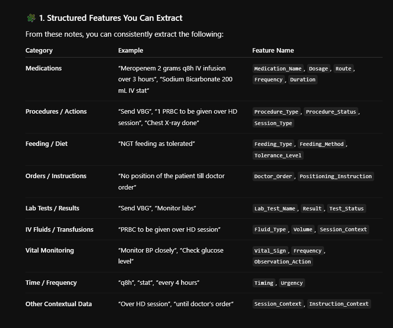
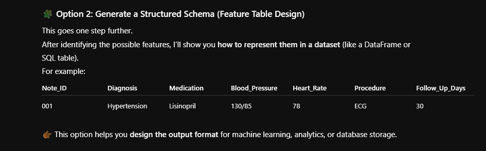

# ClinicalNotes2Features
This project focuses on transforming unstructured clinical notes into structured features that can be used for advanced data analysis and predictive modeling in healthcare. such as diagnoses, medications, symptoms, procedures, and observations—from raw text data to generate comprehensive feature sets for downstream machine learning applications.

# We Can Extract this in 2 ways 
 

